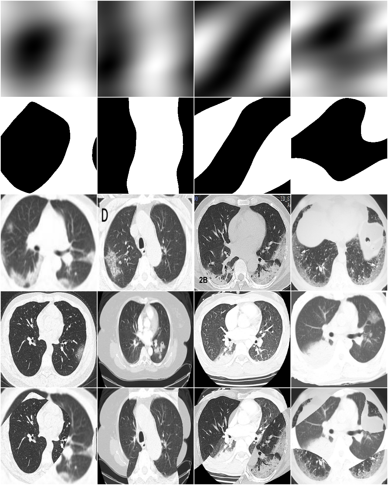

# COVIDClassification_FlyAI
# 1 数据增强
## 1.1 基于albumentations的数据增强： 
 这个数据增强库在各大机器学习平台上极受欢迎，其增强效率、方法之多远甚于其他数据增强库。

       主要采用了以下数据增强方法：

      （1）重新调整图像大小(resize)；

      （2）水平旋转(HorizontalFlip)；

      （3）随机应用仿射变换:平移、缩放和旋转输入(ShiftScaleRotate)；

      （4）图像的弹性变形(ElasticTransform)；

      （5）向输入图像添加高斯噪声(IAAAdditiveGaussianNoise)；

      （6） 随机裁剪区域，填充0像素(cutout)
     
## 1.2 数据增强之FMIX:
- FMix是从随机图像中剪切出任意形状的部分，并将其粘贴到相关图像上；
- 它不同于一般的剪切和粘贴，其需要掩膜来定义图像哪些部分需要考虑；
- 通过对傅里叶空间采样的低频图像进行阈值处理得到掩膜。

# 2 模型结构与设计
  考虑到数据集的大小以及图像的大小，整个过程使用的网络框架有：seresnext50；efficientnet-b2。对网络输出端重新设计，串联两个全连接层，中间嵌入dropout，防止网络过拟合。训练时，使用基于imagenet的预训练模型，这可以使得网络模型更快地收敛。
# 3 超参数设置
- 学习率预热（warm up）,预热epoch=5。这可避免学习率突然增加，使得模型在训练时健康的收敛；
- 标签平滑（label smoothing）, smoothing=0.2，提高模型的健壮性和性能；
- 优化器RAdam, lr=0.003；
- 学习率计划，余弦退火学习率计划（CyclicCosAnnealingLR）
# 4 模型集成与TTA
## 4.1 模型集成
 对seresnext50和efficientnet-b2分别进行6折交叉验证，总共得到12个模型，利用均值法进行模型集成。
## 4.2 TTA
 Test time augmentation(简称TTA)是对测试数据集进行数据扩展的应用程序。       
考虑到医学影像的特殊性，垂直翻转对其没有任何现实意义，本次本赛只通过水平翻转来增加测试集，对其取平均，得到最终得分。
# 答辩视频
[https://www.flyai.com/n/138244
](https://www.flyai.com/n/138244
)